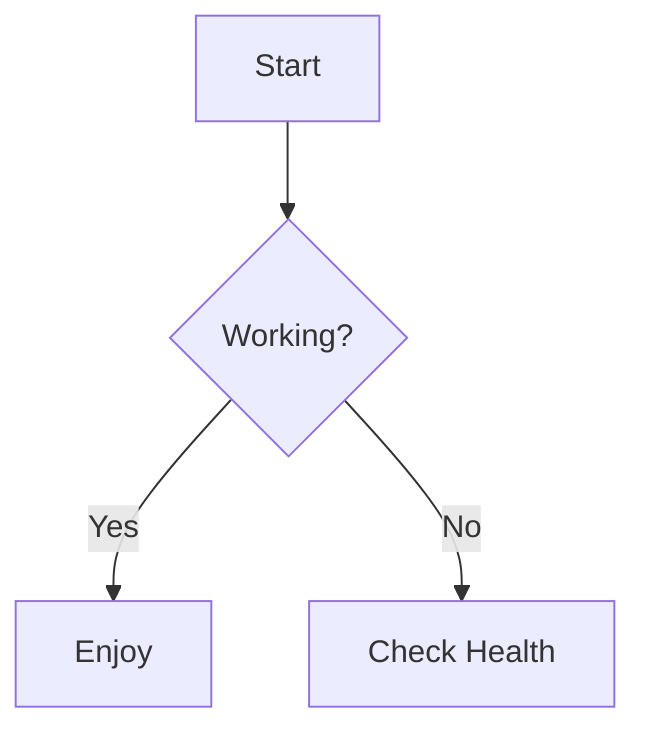

# remark-preview.nvim

A high-performance, highly customizable Markdown previewer for Neovim that utilizes the **remark-rehype** ecosystem
to render GFM-compliant HTML, diagrams, and complex math directly in your browser.


## Prerequisites

Before installing, ensure you have the following installed on your system:

* **Node.js** (LTS recommended)
* **npm** (comes bundled with Node.js)

The plugin uses these to run the rendering engine and the local preview server.


## Features

* **Auto-Sync**: Real-time scroll following that matches your Neovim cursor.
* **Math Support**: High-performance LaTeX ($E=mc^2$) and AsciiMath rendering via KaTeX.
* **Diagrams**: Native support for Mermaid, PlantUML, Graphviz, and more via Kroki integration.
* **GitHub Alerts**: Support for GitHub-style callouts like `> [!NOTE]` and `> [!WARNING]`.
* **HTML Support**: Mixed HTML tags within Markdown are preserved and rendered.
* **PID Isolation**: Run multiple Neovim instances without port or file collisions.
* **Zero Clutter**: All temporary files are stored in the system's temp directory.


## Installation

### Using [lazy.nvim](https://github.com/folke/lazy.nvim)

> [!IMPORTANT]
> This plugin requires Node.js and npm to be available in your system's `$PATH`.

The plugin includes a build hook to automatically manage the necessary NPM dependencies globally.

```lua
{
    "toki83w/remark-preview.nvim",
    ft = "markdown",
    -- Automatically install/update npm dependencies on install or update
    build = function()
        require("remark-preview").build()
    end,
    opts = {
        theme = "dark", -- options: "dark" (Catppuccin Mocha) or "light" (GitHub)
        port_base = 8080,
    },
    keys = {
        { "<leader>mp", "<cmd>RemarkPreviewToggle<cr>", desc = "Toggle Remark Preview" }
    },
}
```


## Commands

* `:RemarkPreviewToggle`: Starts or stops the live preview server.
* `:RemarkPreviewInstall`: Manually triggers the installation of global NPM dependencies.
* `:checkhealth remark-preview`: Verifies that all binaries and node packages are correctly installed.


## Supported Syntax Examples

### Diagrams (Kroki)



### Math

* LaTeX: $e^{i\pi} + 1 = 0$
* AsciiMath: `am x^2 + y^2 = r^2`

### Alerts

> [!NOTE] Alerts are rendered with GitHub-compatible styling.


## Configuration

| Option      | Default  | Description                                  |
|-------------|----------|----------------------------------------------|
| `theme`     | `"dark"` | Sets the CSS theme injected into the preview |
| `port_base` | `8080`   | Starting port for the local server           |


## License

MIT
